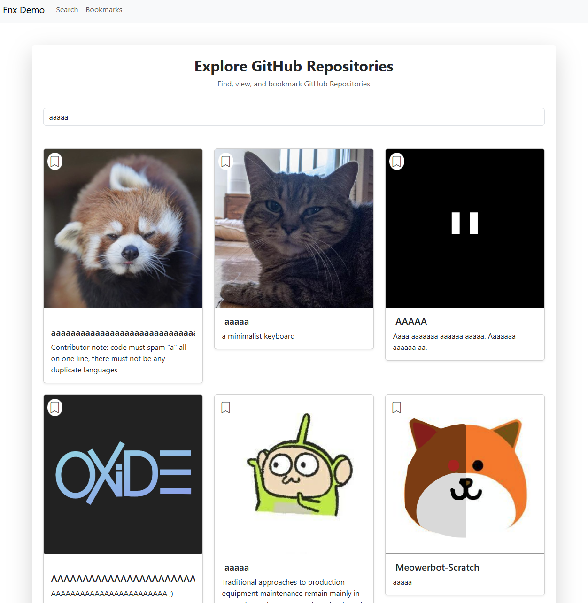

# TamirsFnxDemo


This is a demo project consisting of a **server** and a **client** application. 
The repository contains both the backend server (.Net 9)
and the frontend client(Angular v19),
demonstrating full-stack functionality using .


## Project Structure

```
fnx-tamirs-demo/
├── Client/                  # Angular v19 TypeScript frontend
├── Server/FnxTamirsServer/  # .NET 9 C# backend
├── .gitignore
```


## Installation
```bash
git clone https://github.com/TamirNahum/fnx-tamirs-demo.git
```

```bash
cd fnx-tamirs-demo
```

### Server

Make sure you have the following installed:

- [Node.js](https://nodejs.org/) (for building and running the Angular frontend)
```bash
cd fnx-tamirs-demo\Server\FnxTamirsServer
```
```bash
 dotnet run --project FnxTamirsServer
```
### Client

Make sure you have the following installed:

- [.NET 9 SDK](https://dotnet.microsoft.com/) (for building and running the C# backend)

```bash
cd fnx-tamirs-demo\Client
```
```bash
npm i 
```
```bash
ng serve -o 
```
#### Both Server and Client are ready!!


## Contributing

Pull requests are welcome. For major changes, please open an issue first
to discuss what you would like to change.

Please make sure to update tests as appropriate.

## License

[MIT](https://choosealicense.com/licenses/mit/)